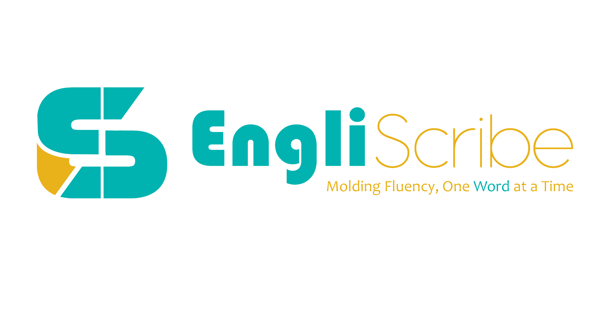

<!-- ABOUT THE PROJECT -->
## About The Project



### Project Description
EngliScribe is a website-based application that uses artificial intelligence as a solution for students to improve the language structure (grammar) of their documents. EngliScribe is designed to improve English literacy and fluency among Indonesian students. This project aims to address the low level of literacy and English language skills in Indonesia, which has a negative impact on access to information, employment opportunities, education, and global participation.

### Demo
[](https://www.youtube.com/watch?v=rSCdGNUufy8)

### Recording & Presentation Folder

[Click Here](https://onedrive.live.com/?id=F8157977D65CAAA6%21165&cid=F8157977D65CAAA6&redeem=aHR0cHM6Ly8xZHJ2Lm1zL2YvcyFBcWFxWE5aM2VSWDRnU1VWci0xODNVZjNFdTFzP2U9QVBSQmxw)

### Methods
EngliScribe uses artificial intelligence (AI) to detect and correct grammatical errors in students' writing. The app also provides an immersive reader feature that helps users learn the language with audio and visual support for each word, making it inclusive for dyslexics.

### Ideas and Solutions:

We realize that low literacy and English language skills hinder many aspects of life. With EngliScribe, we offer solutions to improve English grammar understanding and writing skills. The app not only detects and corrects grammatical errors but also provides ratings and suggestions for improvement.

### Troubleshooting Process:

- **Problem Identification**: Determine the need for increased literacy and English language skills.
- **Solution Development**: Develop easy-to-use applications with advanced AI-based features.
- **Testing**: Conducting trials to ensure the application functions properly and effectively.
- **Implementation** (soon): Launching the application for use by students throughout Indonesia.

### Target User:

Our main target is students in Indonesia from elementary, middle, and high school levels. EngliScribe is also highly recommended for students with dyslexia, as the app is designed to support those who have learning difficulties with writing, spelling, speaking, and reading.

### Reflection on Learning Outcomes:

In working on this project, we learned about the importance of innovation in education and how technology can be used to solve real problems. We also recognize the importance of inclusivity in product development, ensuring that our applications are accessible and usable by everyone, including those with learning difficulties.

### Built With
- Python 3.10.12
- Flask
- Microsoft Azure
  - Azure Document Intelligence
  - Azure Immersive Reader
  - Azure AI Language
  - Azure Machine Learning
  - Microsoft Entra ID (for Resource Management)
- Power BI for Interactive Dashboard


<!-- GETTING STARTED -->
## Getting Started

This is an example of how you may give instructions on setting up your project locally.
To get a local copy up and running follow these simple example steps.

### Prerequisites

This is an example of how to list things you need to use the software and how to install them.
* pip
  ```sh
  pip install -r requirements.txt
  ```

### Installation

1. Get **Python 3.10.12** at [https://www.python.org/downloads/](https://www.python.org/downloads/)
2. Clone the repo
   ```sh
   git clone https://github.com/Chanzwastaken/EngliScribe.git
   ```
3. Install Python packages
   ```sh
   pip install
   ```
4. Install the required Python packages
   ```sh
   pip install -r requirements.txt
   ```


<!-- USAGE EXAMPLES -->
## Usage

Make sure the .env file is available.
```sh
DOCUMENTINTELLIGENCE_ENDPOINT=<insert here>
DOCUMENTINTELLIGENCE_API_KEY=<insert here>

TENANT_ID=<insert here>
CLIENT_ID=<insert here>
CLIENT_SECRET=<insert here>
SUBDOMAIN=<insert here>

VideoIndexerAccountName=<insert here>
ResourceGroup=<insert here>
VideoIndexerSubscriptionId=<insert here>

LANGUAGE_KEY=<insert here>
LANGUAGE_ENDPOINT=<insert here>

AZURE_AI_CHAT_ENDPOINT=<insert here>
AZURE_AI_CHAT_KEY=<insert here>
```
This is an example of how to list things you need to run the software.
```sh
flask run
```


<!-- ROADMAP -->
## Roadmap

- [x] Design Thinking
- [x] PowerPoint
- [x] Power BI Interactive Dashboard
- [x] Flask Webapp Development
  - [x] Features
    - [x] Online OCR
    - [x] Online Correction
    - [x] Immersive Reader
    - [x] Text Summarization
    - [x] Interactive Chatbot

..., more features to be added! (Video Indexer, etc. is currently in development {Next Action})

See the [open issues](https://github.com/Chanzwastaken/EngliScribe/issues) for a full list of proposed features (and known issues).


<!-- CONTRIBUTING -->
## Contributing

Contributions are what make the open-source community such an amazing place to learn, inspire, and create. Any contributions you make are **greatly appreciated**.

If you have a suggestion that would make this better, please fork the repo and create a pull request. You can also simply open an issue with the tag "enhancement".
Don't forget to give the project a star! Thanks again!

1. Fork the Project
2. Create your Feature Branch (`git checkout -b feature/AmazingFeature`)
3. Commit your Changes (`git commit -m 'Add some AmazingFeature'`)
4. Push to the Branch (`git push origin feature/AmazingFeature`)
5. Open a Pull Request


<!-- LICENSE -->
## License

Distributed under the Apache-2.0 License
